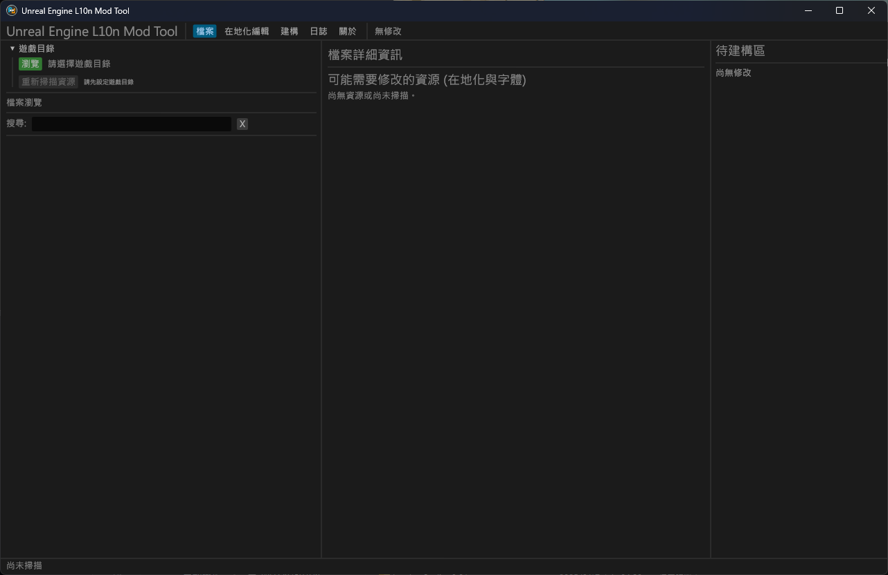
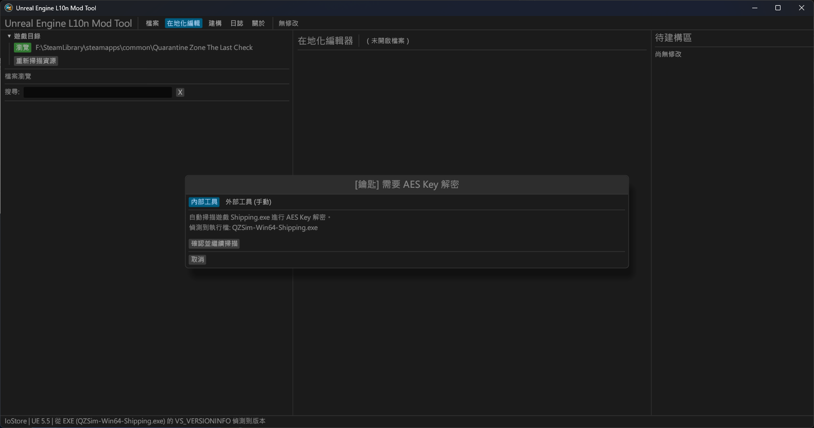
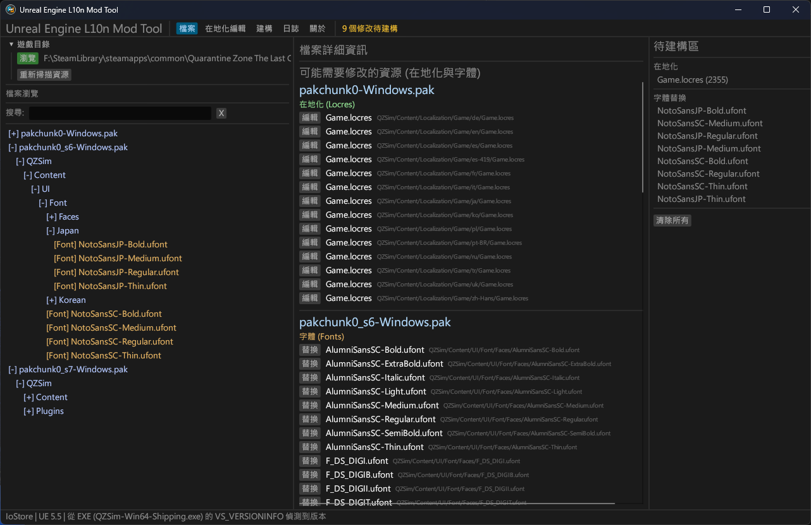
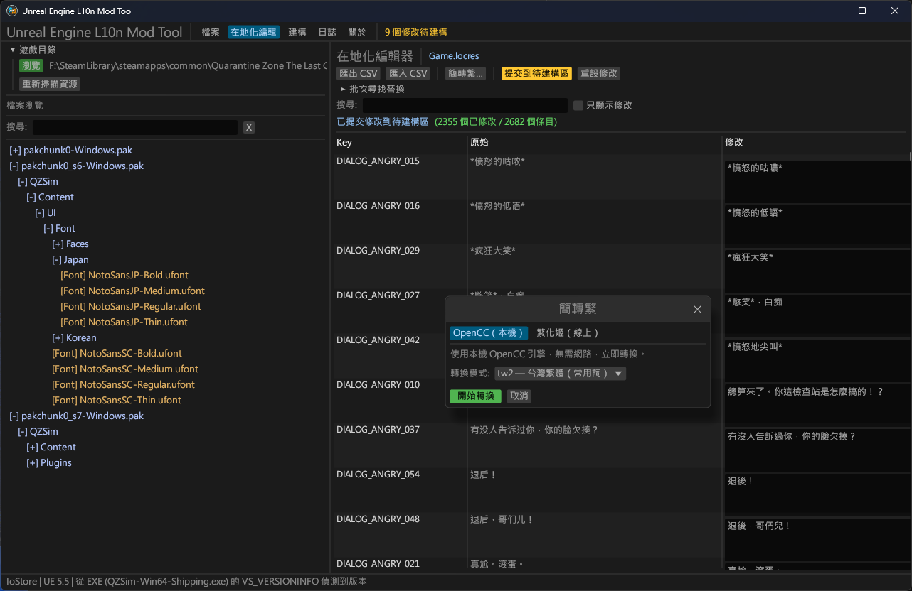
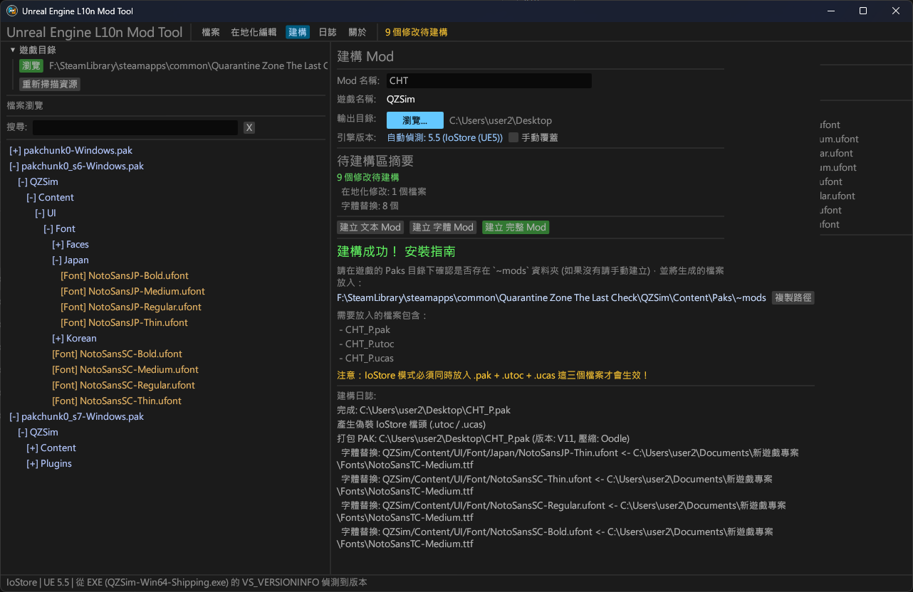
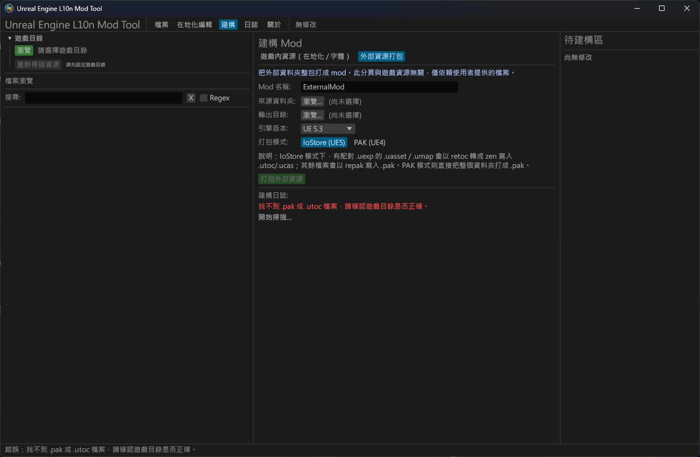
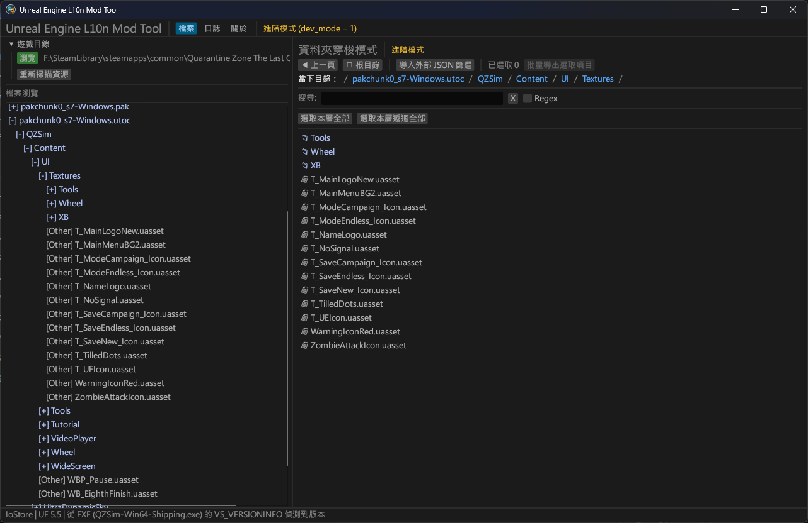

# Unreal Engine L10n Mod Tool (UE 文本/字體模組製作工具)

**Unreal Engine L10n Mod Tool** 是一個專為 Unreal Engine (虛幻引擎) 遊戲開發的圖型化工具，旨在讓玩家能輕鬆地修改遊戲的 **在地化文本（Locres）** ，並提供陽春式的 **字體（uFont）** 替換功能來製作翻譯模組。

<table align="center">
  <tr align="center">
    <td colspan="2" align="center">
      
    </td>
  </tr>

  <tr align="center">
    <td align="center" valign="middle">
      
    </td>
    <td align="center" valign="middle">
      
    </td>
  </tr>

  <tr align="center">
    <td align="center" valign="middle">
      
    </td>
    <td align="center" valign="middle">
      
    </td>
  </tr>
</table>

本工具整合了自動掃描、AES 金鑰提取、簡繁轉換（OpenCC / 繁化姬）以及無縫的模組打包功能，支援傳統的 `Pak` 模式以及 UE5 最新的 `IoStore` (`.utoc`/`.ucas`) 架構。

> [!IMPORTANT]
> 本工具使用建構與字體替換流程非遊戲引擎標準，可能有無法使用的問題。但操作簡單，且多數情況下可以正常使用，所以採用此方式。
> 
> 相容性：可能因遊戲對引擎的客製化程度不同導致無法使用本工具處裡，僅適配標準配置的遊戲。已確認不支援如 `ACE COMBAT 7` 這種對EXE加密以及特殊目錄的遊戲。
> 

---

## 主要功能

*   **掃描與偵測**
    *   自動偵測遊戲的 Unreal Engine 版本 (UE4.0 ~ UE5.7+)。
    *   自動識別遊戲打包模式 (`Pak` 或 `IoStore`)。
    *   內建 AES Key 提取器：自動掃描 `Shipping.exe` 獲取解密金鑰，也支援手動輸入外部金鑰。
*   **在地化文本 (.locres) 編輯**
    *   直接讀取並解析遊戲內的 `.locres` 檔案。
    *   內建編輯器，支援搜尋、批次尋找與替換。
    *   支援與 **CSV** 格式雙向匯出/匯入，方便使用 Excel 等外部工具協作翻譯。
*   **內建簡繁轉換**
    *   **OpenCC (本機端)**：內建多種轉換模式 (tw2, twp, tw, hk)，離線即可瞬間完成轉換。
    *   **繁化姬 API (線上)**：整合 [ZhConvert 繁化姬](https://zhconvert.org/) 服務，支援更精確的語境與台灣用語轉換。
*   **字體替換支援**
    *   支援替換遊戲內的 `.ufont` 字體檔案。
    *   可多選檔案進行**批量字體替換**。
*   **一鍵建構 Mod**
    *   自動生成目標遊戲於 `~mods` 資料夾的 `_P.pak` 檔案。
    *   支援 UE5 IoStore，自動生成並配對 `.utoc` 與 `.ucas` 檔案。

---

## 快速開始

### 1. 下載工具
請前往 [Releases](https://github.com/tents89/UEGame-SC2TC/releases) 下載適用於您作業系統的版本。

> *注意：本工具僅支援載入Windows版本的遊戲。*

### 2. 使用教學
1. **選擇遊戲目錄**：點擊左上角的「遊戲目錄」按鈕，選擇遊戲的根目錄（例如：`SteamLibrary/steamapps/common/YourGame`）。
2. **自動掃描**：工具會自動尋找 `Shipping.exe` 並嘗試提取 AES Key。若遊戲已加密且自動提取失敗，工具會提示您使用外部工具取 AES Key 並手動輸入。
3. **編輯資源**：
   * **文本**：在左側樹狀圖找到 `.locres` 檔案，雙擊開啟編輯器進行翻譯（或簡轉繁），也可以匯出/匯入 CSV。
   * **字體**：右鍵點擊字體檔案 (`.ufont` 等)，選擇「替換字體」。

> [!NOTE]
> 語言代碼：`en`代表英文、 `zhs`與`zhhans`代表簡體中文。
> 
> 字體：簡體中文字體通常使用 `NotoSansSC` `NotoSerifSC`相關名稱，少數遊戲使用CJK，這部分需要自己去嘗試，但通常很直覺。字體名稱可以去Google可以得知是什麼字體。這邊提到的兩種字體繁體中文不太會缺字，但如果是其他的可能需要更換字體，這部分需要自己去外面或[這裡](https://fonts.google.com/?preview.script=Hant&preview.lang=zh_Hant&lang=zh_Hant)找到，點擊 `Get font` 並按下 `Download` 下載。

4. **提交到待建構區**：在地化確認編輯無誤後，會將修改提交至「待建構區」。
5. **建構 Mod**：切換至「建構」面板，選擇輸出目錄，點擊「建立 完整 Mod」。
6. **安裝 Mod**：將生成的檔案放進遊戲的 `Paks/~mods` 資料夾中即可生效！

> [!NOTE]
> 如沒有，請在遊戲的 Paks 中自己新增名為 `~mods` 的資料夾。
>
> 若遊戲使用AES且在Paks中發現`.sig`，請參考此[補丁](https://github.com/rm-NoobInCoding/UniversalSigBypasser)來繞過簽名驗證。使用方式是解壓縮至 `Binaries/Win64`中。

---

## 進階功能

<table align="center">
   <tr align="center">
    <td align="center" valign="middle">
      
    </td>
    <td align="center" valign="middle">
      
    </td>
  </tr>
</table>


1. **打包模組**：建置頁面中的分頁提供打包外部檔案，取代繁瑣操作。
> [!NOTE]
> 來源資料夾：要打包檔案 `F:/YourMod/GameName/Content/Localization/Game/en/Game.locres`
> 
> 請選擇"YourMod"即可，不要選到GameName。

2. **進階模式**：可以在關於頁面中啟用進階模式，本模式僅供探索與解包，不提供製作功能。
> [!NOTE]
> 模式開關後，請重新啟動程式避免任何問題。

> ### 進階模式的外部篩選功能（請自己記錄並命名為 .json）
>
>* **Key 值規範**：不分大小寫（例如：`path` / `Path` / `PATH`）。
>* **支援三種 JSON 寫法**：
>  * **單字串**
>    ```json
>    { "Path": "Name/Content/XXXX/A.uasset" }
>    ```
>  * **字串陣列**
>    ```json
>    { "Path": ["Name/Content/XXXX/B.uasset", "Name/Content/XXXX/C.uasset"] }
>    ```
>  * **巢狀結構**
>    ```json
>    {
>      "items": [
>        { "path": "Name/Content/XXXX/Game" }
>      ]
>    }
>    ```

---

## 本工具使用以下遊戲進行完整功能測試：

* *Titan Quest II*
* *Quarantine Zone: The Last Check*
* *Subnautica 2*

---

## 開發與建構 (Build from Source)

請先確保您的系統已安裝 [Rust](https://rustup.rs/)。

### 1. 安裝系統依賴 (System Dependencies)

**Windows:**
安裝 Rust 時預設勾選安裝 **Visual Studio C++ Build tools** 即可。

**macOS:**
```bash
xcode-select --install
```

**Linux (Ubuntu / Debian):**
```bash
sudo apt-get update
sudo apt-get install -y libgtk-3-dev libglib2.0-dev libxcb-shape0-dev libxcb-xfixes0-dev libfontconfig1-dev
```

### 2. Build

```bash
# 複製專案
git clone https://github.com/tents89/UEGame-SC2TC.git
cd UE_ConvertTC

# 編譯 Release 版本
cargo build --release -p gui
```

編譯完成後，執行檔將產生於 `target/release/` 目錄下：
* Windows: `target/release/UE_L10nTool.exe`（已隱藏 console 黑窗）
* macOS / Linux: `target/release/UE_L10nTool`

> *macOS 提示：執行檔可直接執行；若需要 Dock 圖示與檔案關聯，請另以 [`cargo-bundle`](https://github.com/burtonageo/cargo-bundle) 打包成 `.app`（本專案未提供官方 bundle 設定）。*

### 3. 啟動 Log 位置

工具啟動時的字型載入訊息會寫入下列檔案：

| 平台 | 檔案路徑 |
|------|----------|
| Windows | `%APPDATA%\UE_L10nTool\startup.log` |
| macOS   | `~/Library/Application Support/UE_L10nTool/startup.log` |
| Linux   | `${XDG_DATA_HOME:-~/.local/share}/UE_L10nTool/startup.log` |

```

### 專案結構
專案採用 Workspace 架構：
* `core/`: 負責所有底層邏輯（PAK 解析、IoStore 處理、Locres 讀寫、AES 提取、API 串接）。
* `gui/`: 基於 `eframe`/`egui` 的圖形使用者介面與狀態管理。
* `icon/`: 包含各平台的應用程式圖示設定。
* `assets/`: README.md圖片。
```

---

## Credits

*沒有以下專案就沒有此工具，感謝它們。*

| Credits | Lib | Application |
| ------- | --- | ----------- |
| trumank | [repak](https://github.com/trumank/repak) / [retoc](https://github.com/trumank/retoc) | 核心 PAK/IoStore 讀寫支援。|
| AceHanded | [locres-rs](https://github.com/trumank/repak) | Unreal Engine 在地化檔案 `.Locres` 解析。|
| doggy8088 | [opencc-rust](https://github.com/doggy8088/opencc-rust) | Rust版 OpenCC離線簡繁轉換引擎。|
| yuhkix | [aesdumpster-rs](https://github.com/yuhkix/aesdumpster-rs) | AES Key 記憶體特徵碼提取演算法。|
| Fanhuaji | [繁化姬](https://zhconvert.org) | 提供強大的線上繁簡轉換 API 服務。 |

---

## License

This project is open-sourced under the MIT, APACHE2.0 License - see the LICENSE file for details.

```
 免責聲明：本工具僅供學術研究，與 Epic 公司無任何關聯。

 本項目使用AI輔助製作，
```
